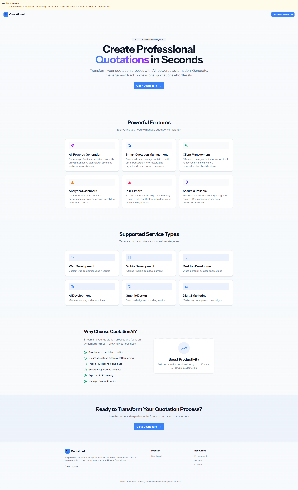
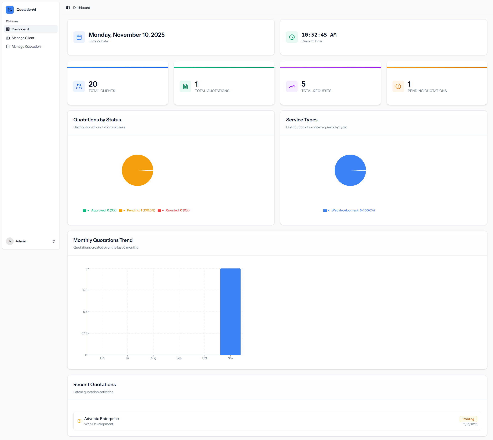
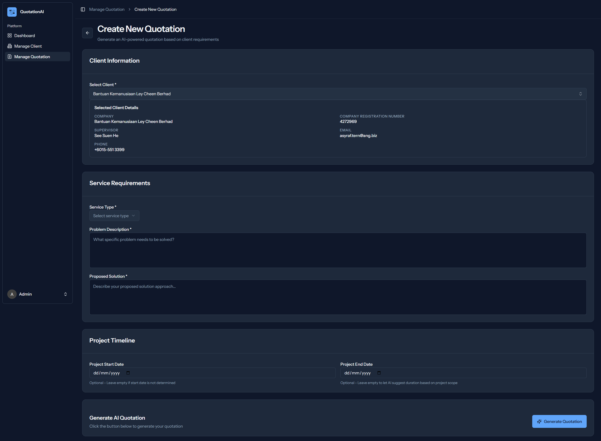
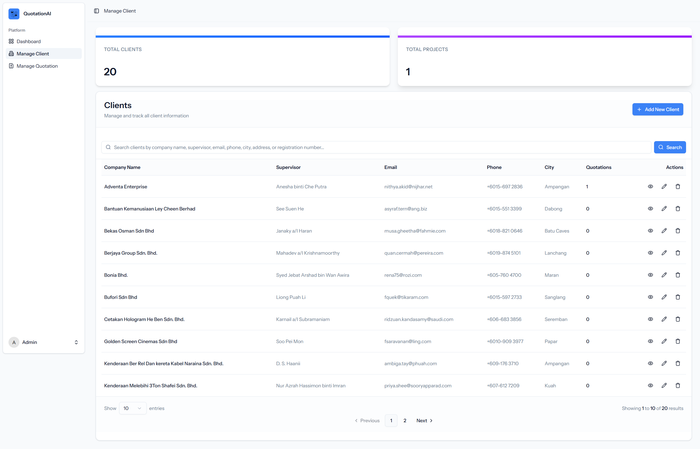
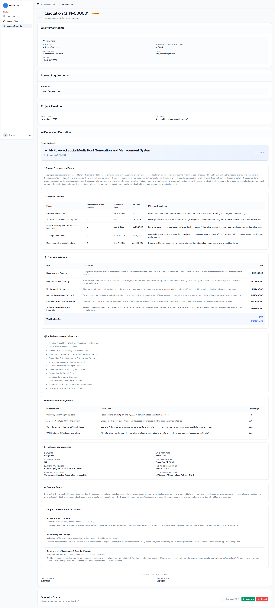
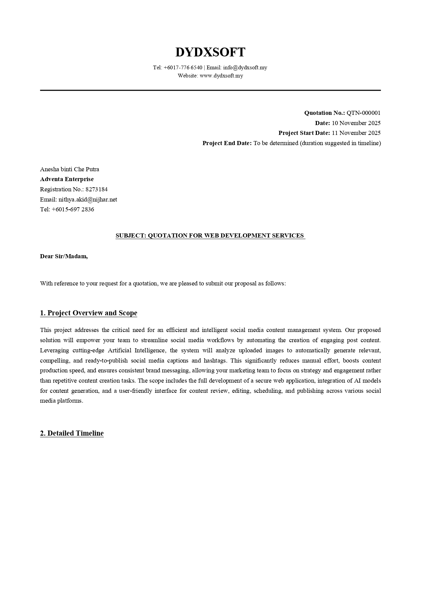

# QuotationAI

*Landing page for the Quotation AI Generator*

An AI-powered quotation management system built with Laravel and React. This application helps businesses generate professional quotations automatically using Google Gemini AI, manage clients, and export quotations as PDFs.

## 🚀 Features

- **AI-Powered Quotation Generation**: Automatically generate professional quotations using Google Gemini API
- **Client Management**: Manage client information including company details, contact information, and registration numbers
- **Quotation Requests**: Create and manage quotation requests with problem statements and proposed solutions
- **PDF Export**: Generate and download quotations as professional PDF documents
- **User Authentication**: Secure user authentication and authorization system
- **Dashboard**: Overview of quotations, clients, and recent activities
- **Settings Management**: User profile, password, and appearance settings
- **Service Types**: Support for various service types including:
  - Web Development
  - Mobile Development
  - Desktop Development
  - AI Development
  - Graphic Design
  - Digital Marketing
  - Other

## 🛠️ Tech Stack

### Backend
- **Laravel 12**: PHP framework
- **PHP 8.2+**: Programming language
- **SQLite**: Database (can be configured for MySQL/PostgreSQL)
- **DomPDF**: PDF generation
- **Google Gemini API**: AI quotation generation

### Frontend
- **React 19**: UI library
- **TypeScript**: Type-safe JavaScript
- **Inertia.js**: Modern monolith approach
- **Tailwind CSS 4**: Utility-first CSS framework
- **Radix UI**: Accessible UI components
- **Vite**: Build tool and dev server

## 📋 Prerequisites

Before you begin, ensure you have the following installed:
- PHP 8.2 or higher
- Composer
- Node.js 18+ and npm
- SQLite (or MySQL/PostgreSQL)
- Google Gemini API Key

## 🔧 Installation

1. **Clone the repository**
   ```bash
   git clone <repository-url>
   cd quotationAI
   ```

2. **Install PHP dependencies**
   ```bash
   composer install
   ```

3. **Install Node.js dependencies**
   ```bash
   npm install
   ```

4. **Environment Configuration**
   ```bash
   cp .env.example .env
   php artisan key:generate
   ```

5. **Configure Environment Variables**
   Edit `.env` file and add your configuration:
   ```env
   GEMINI_API_KEY=your_gemini_api_key_here
   DB_CONNECTION=sqlite
   DB_DATABASE=database/database.sqlite
   ```

6. **Database Setup**
   ```bash
   touch database/database.sqlite
   php artisan migrate
   ```

7. **Build Assets**
   ```bash
   npm run build
   ```

## 🚀 Running the Application

### Development Mode

Run all services concurrently (server, queue, and Vite):
```bash
composer run dev
```

Or run services individually:

**Start Laravel server:**
```bash
php artisan serve
```

**Start Vite dev server:**
```bash
npm run dev
```

**Start queue worker:**
```bash
php artisan queue:listen
```

### Production Mode

1. **Build assets**
   ```bash
   npm run build
   ```

2. **Optimize Laravel**
   ```bash
   php artisan config:cache
   php artisan route:cache
   php artisan view:cache
   ```

3. **Start server**
   ```bash
   php artisan serve
   ```

## 🧪 Testing

Run tests using Pest:
```bash
composer test
```

Or using PHPUnit directly:
```bash
php artisan test
```

## 📁 Project Structure

```
quotationAI/
├── app/
│   ├── Http/
│   │   ├── Controllers/     # Application controllers
│   │   ├── Middleware/      # HTTP middleware
│   │   └── Requests/        # Form request validation
│   ├── Models/              # Eloquent models
│   └── Providers/           # Service providers
├── config/                  # Configuration files
├── database/
│   ├── migrations/          # Database migrations
│   ├── seeders/             # Database seeders
│   └── factories/           # Model factories
├── public/                  # Public assets
├── resources/
│   ├── js/
│   │   ├── components/      # React components
│   │   ├── layouts/         # Layout components
│   │   ├── pages/           # Inertia pages
│   │   └── hooks/           # React hooks
│   ├── css/                 # Stylesheets
│   └── views/               # Blade templates
├── routes/                  # Route definitions
├── storage/                 # Storage directory
└── tests/                   # Test files
```

## 🔑 Key Features Explained

### AI Quotation Generation

The system uses Google Gemini API to generate structured quotations based on:
- Client information
- Service type
- Problem statement
- Proposed solution
- Project dates (optional)

The AI generates:
- Project overview and scope descriptions
- Detailed service/item descriptions
- Suggested pricing for individual items
- Timeline estimates and milestone descriptions
- Technical requirements
- Deliverables descriptions

### Quotation Management

- Create quotation requests with problem and solution
- Generate AI-powered quotations automatically
- Edit and customize quotations
- View quotation details
- Export quotations as PDF
- Track quotation status

### Client Management

- Add and manage client information
- Store company details, contact information, and registration numbers
- Link clients to quotations and quotation requests
- View client history

## 🖼️ Screenshots

### Dashboard

*Overview of quotations, clients, and recent activities*

### Create Quotation

*AI-powered quotation generation interface*

### Client Management

*Manage client information and company details*

### View Quotation

*Detailed view of generated quotation*

### PDF Export

*Professional PDF quotation document*

## 🔒 Security

- User authentication and authorization
- CSRF protection
- SQL injection protection (using Eloquent ORM)
- XSS protection
- Secure password hashing
- Environment variable configuration for sensitive data

## 📝 License

This project is open-sourced software licensed under the [MIT license](https://opensource.org/licenses/MIT).

## 🤝 Contributing

Contributions are welcome! Please feel free to submit a Pull Request.

## 📧 Support

For support, please open an issue in the repository or contact the development team.

## 🎯 Roadmap

- [ ] Multi-tenant support
- [ ] Email notifications
- [ ] Quotation templates
- [ ] Advanced reporting and analytics
- [ ] Integration with payment gateways
- [ ] Mobile app
- [ ] API documentation

## 🙏 Acknowledgments

- [Laravel](https://laravel.com/)
- [React](https://react.dev/)
- [Inertia.js](https://inertiajs.com/)
- [Google Gemini API](https://ai.google.dev/)
- [Tailwind CSS](https://tailwindcss.com/)
- [Radix UI](https://www.radix-ui.com/)

